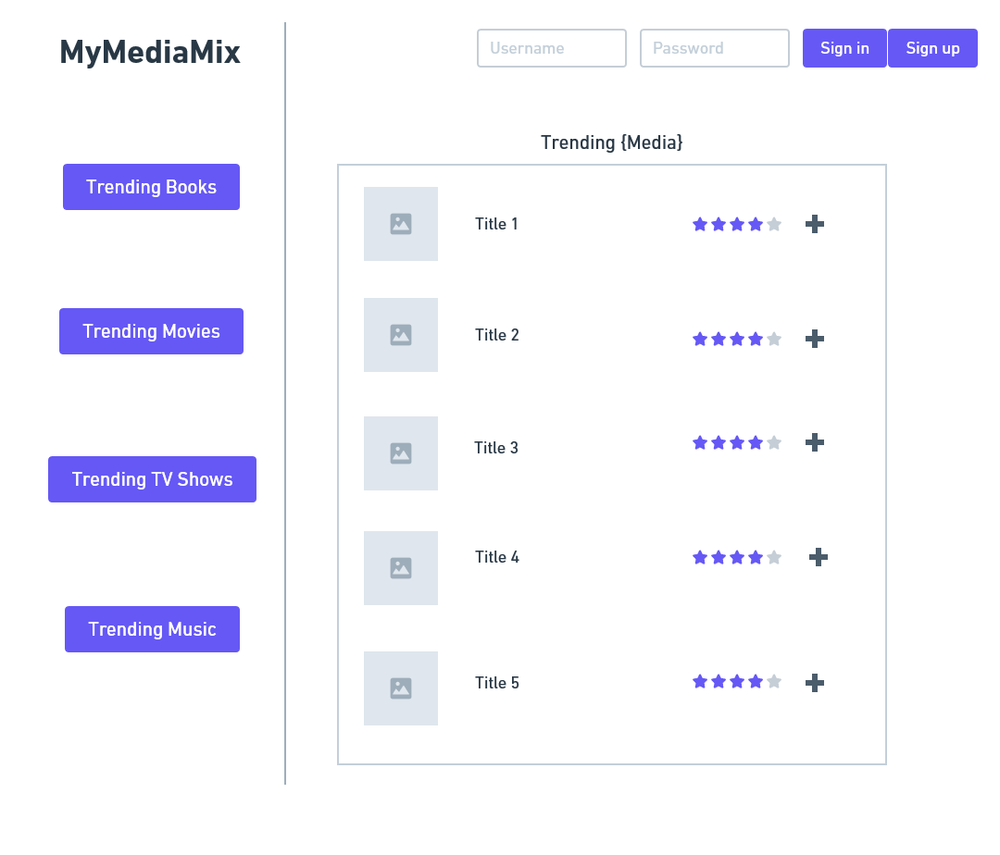
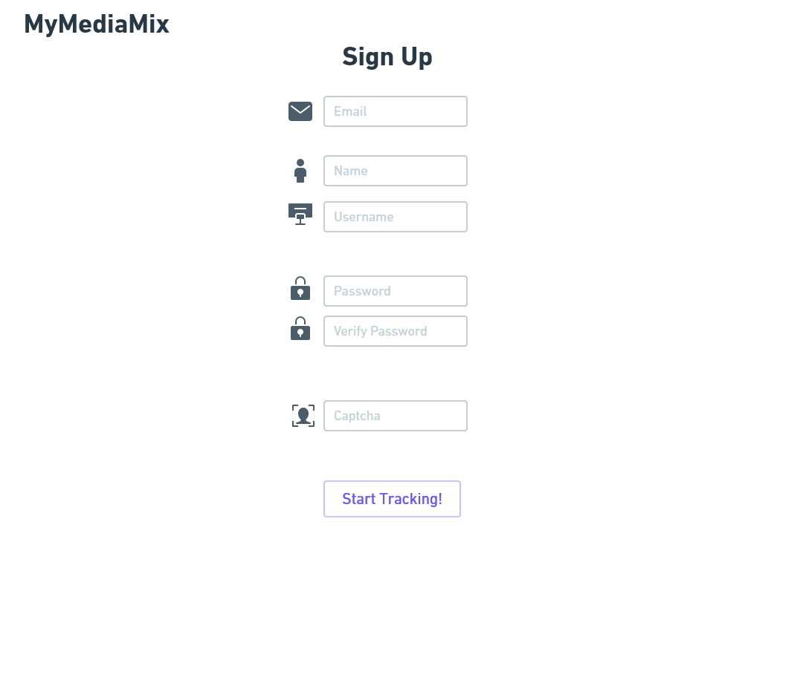
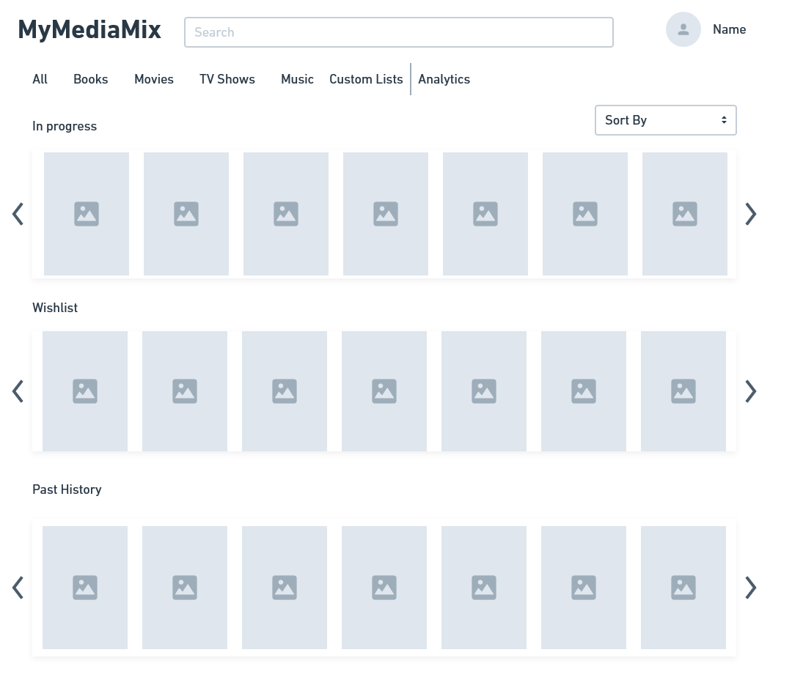
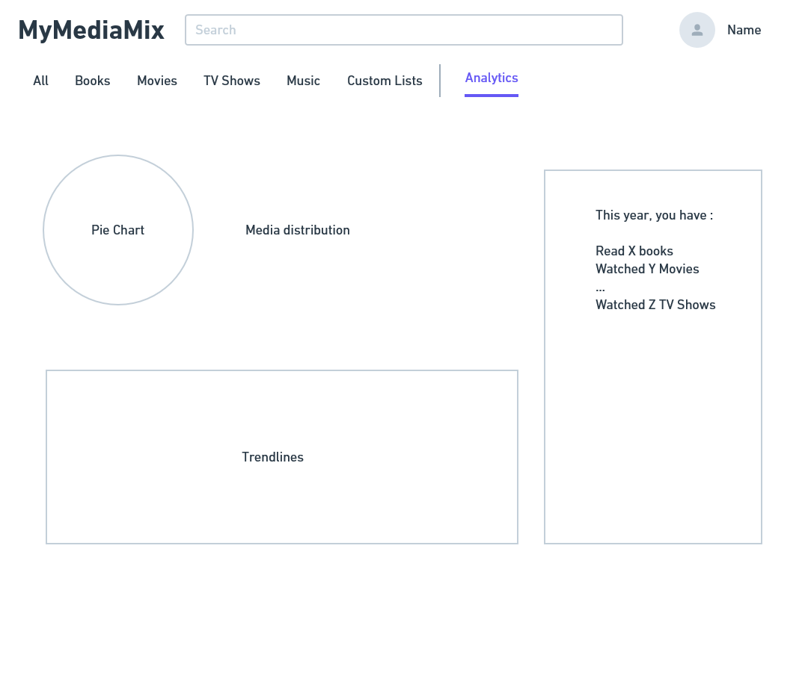
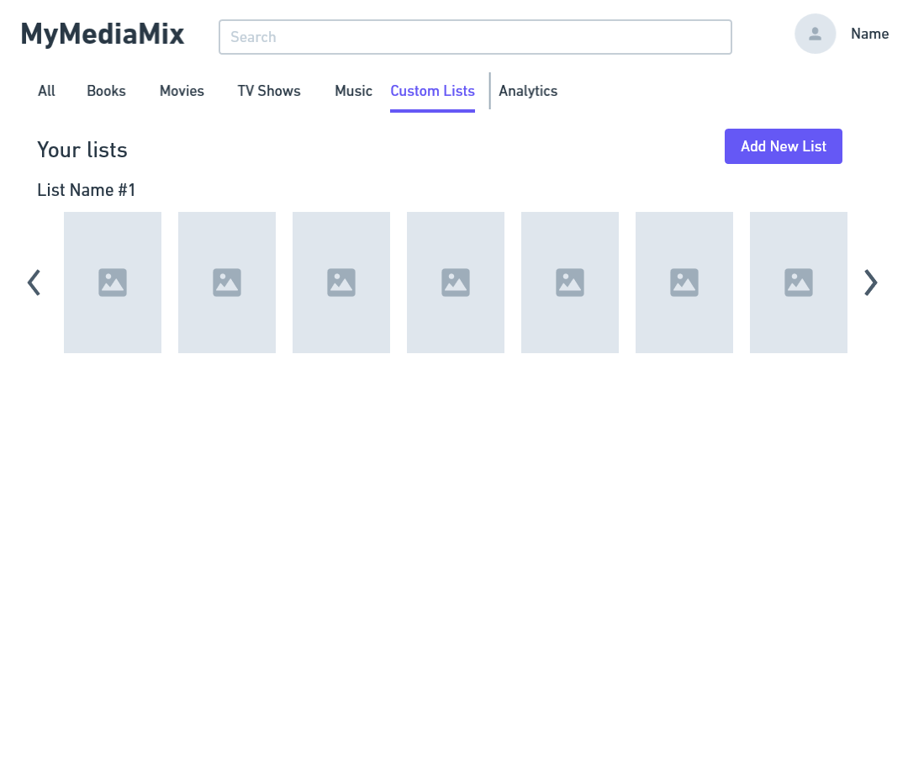
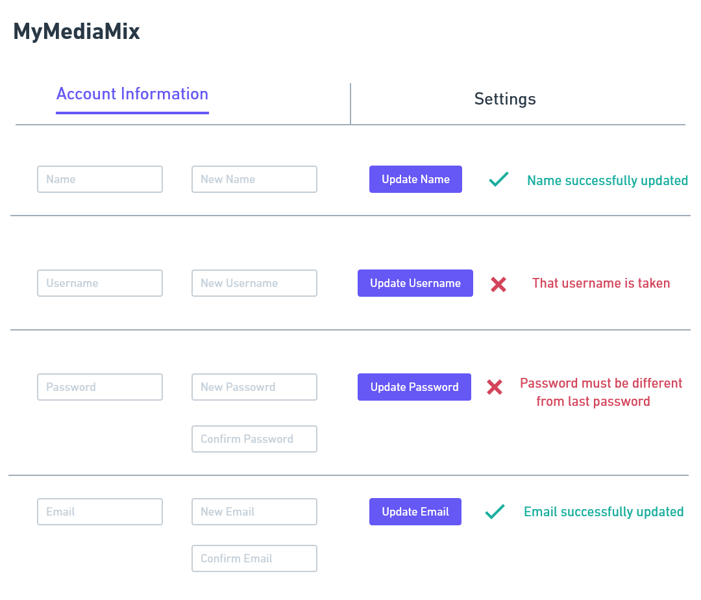
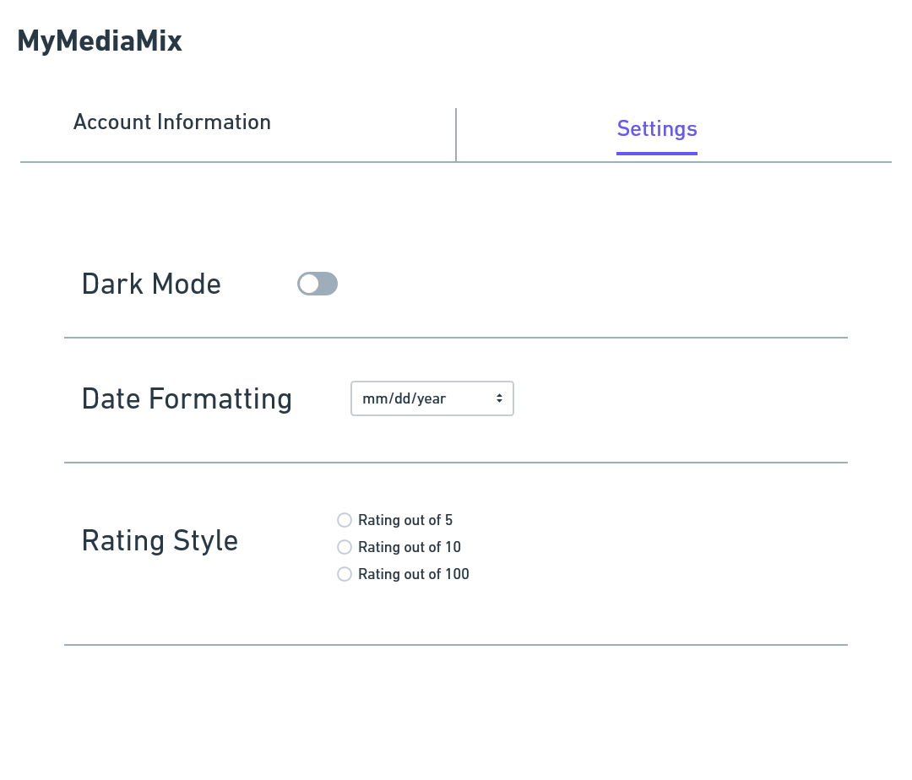
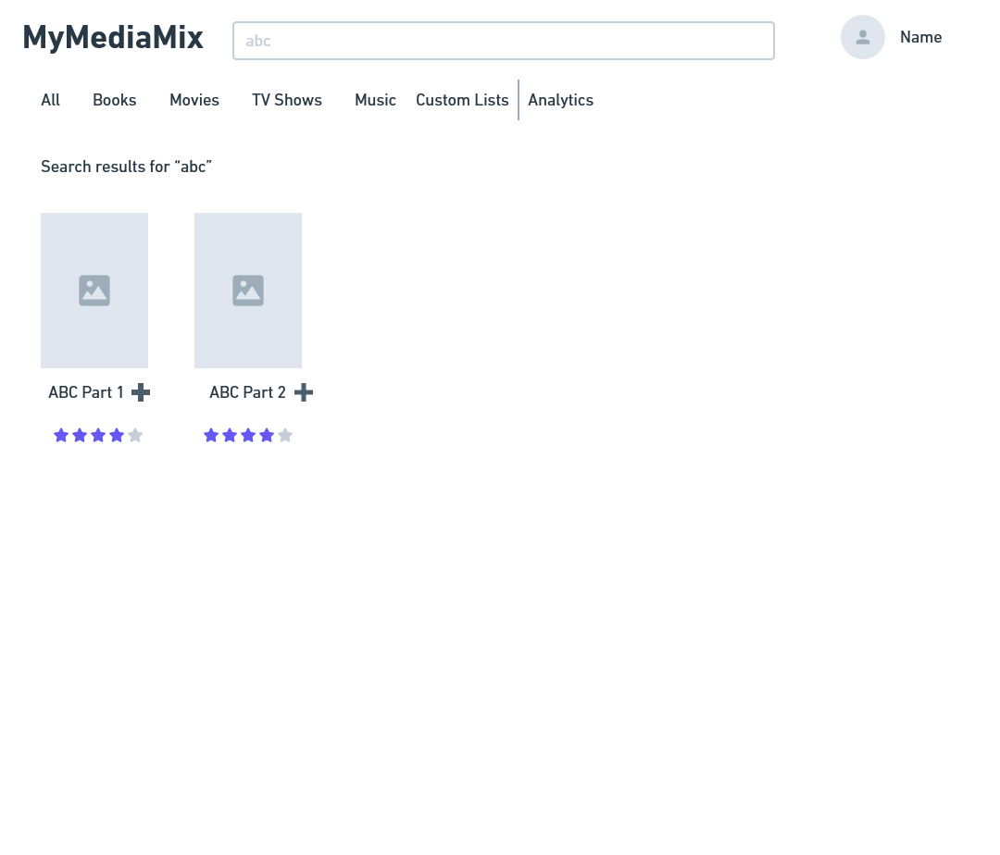

# Wireframe Explanations

### Landing Page

This is the page that a user will land on when they go the MyMediaMix website assuming they are not signed in. Here, we show the media that is trending across the website globally, along with their ratings and the ability to add them to your list.

### Signup Page

Here is our proposed implementation of a signup page. It is relatively basic and respects your privacy (as a media tracking website should). We require first name, username, email, and password.

### List Page

This is the crux of our web application. After sign in or sign up, a user will be directed here. Here, a user will see their in progress media forms (In progress), their to-watch/read/listen media forms (wishlist), and media that they have completed (Past History). Additionally, a user can sort by books, movies, etc.

### Analytics Page

This page displays analytics to the user based on their media intake. This includes percentages of what media they have consumed. Also, the right column is a display of how many of a media form they have used in a certain timeframe.

### Custom List Page

This page is like the list page, but works for user-defined tags. An example is a tag that defines happy endings, and a user can set that for any media they have.

### Account Info Page

This page allows users to change their information to be more dynamic as a site.

### Settings Page

This page defines some settings that users may like to have the ability to change. This includes dark mode (which may be too ambitious), date formatting (dd/mm/year or mm/dd/year), and rating style (9/10 or 4.5/5 or 90/100).

### Search Page

This page displays search results when searching from the list page. This is the main page where a user would add things to their list, and this can be done with the '+' button.

## Division of Labor:
### Wireframe
The wireframe was done on whimsical and we did it while talking on a zoom. Consequently, everyone in the group did the same amount of work on the wireframe.

## HTML/CSS
Again, the entire group worked very evenly on the html/css. More specifically, we had

Bill - Landing & ___ pages

Thao - List & ___ pages

Jarred - Signup & Account pages
