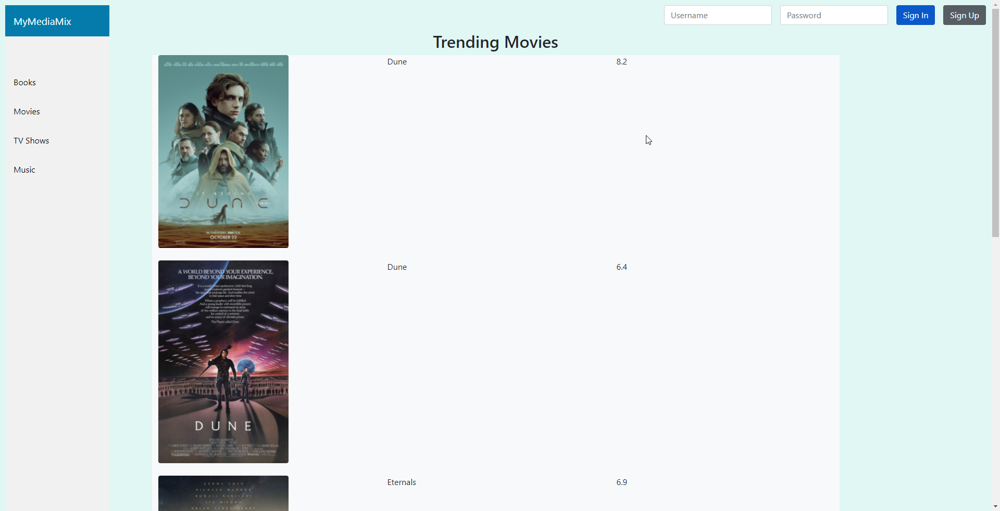

# Milestone 2

### Representation of API for application
As our focus is on a media tracking service, most of our API includes queries for media items, and then the ability to add or remove them from a particular user's list. We define two types of objects in our system:

- **Media Item**: Media items contain different field depending on their type. For now, we have TV shows and Movies which are queried from an IMDB api (with 100 free api calls per day).
  - **Movies**: Title, Image, Rating. Year, Crew, Rank, RatingCount
  - **TV Shows**: Title, Image, Rating. Year, Crew, Rank, RatingCount

- **User Account**: User accounts will have three lists when created in the database. These lists are
  - **Plan to watch**: A list of media that a user is currently preoccupied with.
  - **Watched**: A list of media that a user has watched/read/listened to before.
  - **Currently Watching**: A list of media that a user is currently preoccuped with.

 Our endpoints are as follows:

-   **/signup-page** This will simply route a user to the signup page in order to make a new account.

-   **\***  This is the wildcard route and it will tell a user that the specified page does not exist.
-   **/** This will route users to the landing page of the website (index.html).

-   **/register** Each user will be required to make an account (which will eventually occur within our database), and this will be used to store their tracked media list between sessions. This could be possible with cookies or sessions, but we want to ensure security of users' lists by using a database.

-   **/login** Similarly, users can login to their account to see their tracked media. Logging in is essential to keep persistence between visits and also security This will also be performed with a database.

-  **/add/{item}** When a user is specified (i.e. a user is logged in), they can use this endpoint to add a media item to their list. Additionally, they can add ratings, and other external features when they are adding a media item to their list/

-  **/remove/{item}** When a user is specified (i.e. a user is logged in), they can use this endpoint to remove a media item from their list.

-  **/get/{item}** When a user is specified (i.e. a user is logged in), they can use this endpoint to simply view the item specified on their list. This will additionally return other external features, like rating, etc. If the item is not on their list, then they will receive some kind of error telling gthem that the requested media is not on their list.

-  **/search/{item}** This endpoint will query all media available on the website for the specific media that the user requested. If it is available on the website, all relevant information about the media will be returned to the user which includes title, cast, director, rating, etc. If it is not available on the website, an error message will be shown to the user.

### Client Interface with descriptions

### Listing Most Popular 5 movies on IMDB currently (Read)

Above, we see the results of clicking on trending movies on the landing page, which shows the top 250 most popular movies on IMDB.

Above, we see the results of clicking on trending Tv Shows on the landing page, which shows the top 250 most popular TV shows on IMDB.

### Heroku URL
https://mymediamix.herokuapp.com

### Divison of Labor
Jarred: I handled the server.js routing and setting up the IMDB api (which is limited to 100 calls per day).

Bill:

Thao:
